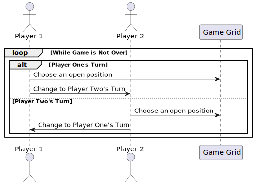

> [Back To README](README.md)

# Tic-Tac-Toe Core Loop Questions Answered

The core loop of the game, formalized to more easily create a project from. It answers our questions from the main readme.

## What is the core loop of the game?

## How do we start that loop?

The loop starts upon a new game beginning, after the starting player has chosen their character, `X` or `O`.

## What makes that loop end?

The loop ends once the game is officially over. See [rules](rules.md) for more detail.
